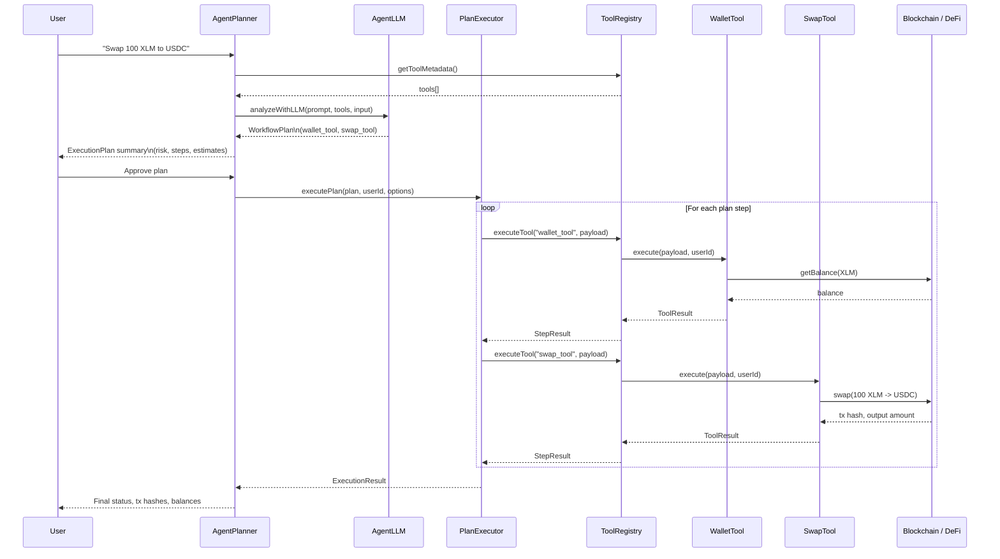

## Agent–Tool–Service Architecture (Mermaid)

This document provides Mermaid diagrams that show how agents, the tool registry, and external services interact inside Chen Pilot.

> To preview these diagrams, use a Mermaid-compatible Markdown viewer (such as the Mermaid extension in VS Code/Cursor).

---

## High-Level Flow: From User to External Services

```mermaid
flowchart TD
  U[User / Client] -->|Natural language request| AP[AgentPlanner]

  AP -->|Get tool metadata| TR[ToolRegistry]
  TR -->|Available tools & metadata| AP

  AP -->|Planner prompt with tools\n+ user input| LLM[AgentLLM / External LLM]
  LLM -->|WorkflowPlan (JSON)| AP

  AP -->|ExecutionPlan| PE[PlanExecutor]

  PE -->|Execute step| TR
  TR -->|Invoke tool| T[Registered Tools\n(wallet, swap, soroban, ...)]
  T -->|RPC / HTTP calls| S[External Services\n(Blockchains, DeFi protocols,\nwallet providers, APIs)]
  S -->|Results / tx hashes| T

  T -->|ToolResult| TR
  TR -->|StepResult| PE
  PE -->|Aggregated ExecutionResult| U
```

**Legend**

- **AgentPlanner**: Analyzes user intent, calls the LLM, and produces an `ExecutionPlan`.
- **AgentLLM / External LLM**: Large language model used for planning (e.g., Claude, OpenAI, etc.).
- **ToolRegistry**: Discovers tools, exposes metadata, and executes them.
- **Registered Tools**: Concrete implementations (wallet, swap, Soroban, etc.).
- **External Services**: Blockchains, DeFi protocols, and any external APIs or infrastructure the tools call.

---

## Detailed Example: "Swap 100 XLM to USDC"



This sequence diagram focuses on the interactions between:

- **Agents** (`AgentPlanner`, `PlanExecutor`, `AgentLLM`)
- **Tools & ToolRegistry**
- **External Services** (blockchains / DeFi protocols)

